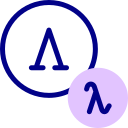

# QUILAB Quantum Informatics Laboratory @ University of Verona
  
  
## About

## Publications  
  
|  |  |  |  
| ------------------------------------------- | --- | --- | 
| [Quantum Language & Semantics](#anchor_qlang) | [Quantum Logic & Computational models](#anchor_qlogic) | [Quantum Machine Learning & Applications](#anchor_qml) | 

### Quantum Language & Semantics 

### Quantum Logic & Computational models

#### 2020
1. S. Guerrini, S. Martini, A. Masini: Quantum Turing Machines: Computations and Measurements, Appl. Sci. 2020, 10(16), 5551; https://doi.org/10.3390/app10165551
### Quantum Machine Learning & Applications

#### 2022
1. Di Marcantonio, F., Incudini, M., Tezza, D., & Grossi, M. (2022). QuASK--Quantum Advantage Seeker with Kernels. arXiv preprint arXiv:2206.15284.
2. Incudini, M., Martini, F., & Di Pierro, A. (2022). Structure Learning of Quantum Embeddings. arXiv preprint arXiv:2209.11144.
3. Incudini, M., Tarocco, F., Mengoni, R., Di Pierro, A., & Mandarino, A. (2022). Computing graph edit distance on quantum devices. Quantum Machine Intelligence, 4(2), 1-21.

#### 2021
1. Di Pierro, A., & Incudini, M. (2021). Quantum Machine Learning and Fraud Detection. In Protocols, Strands, and Logic (pp. 139-155). Springer, Cham.
2. Mengoni, R., Incudini, M., & Di Pierro, A. (2021). Facial expression recognition on a quantum computer. Quantum Machine Intelligence, 3(1), 1-11.
 
#### 2020
1. Mengoni, R., Di Pierro, A., Memarzadeh, L., & Mancini, S. (2020). Persistent homology analysis of multiqubit entanglement. Quantum Information and Computation, 20(5&6), 375-399.

#### 2019
1. Mengoni, R., & Di Pierro, A. (2019). Kernel methods in quantum machine learning. Quantum Machine Intelligence, 1(3), 65-71.

#### 2018
1. Windridge, D., Mengoni, R., & Nagarajan, R. (2018). Quantum error-correcting output codes. International Journal of Quantum Information, 16(08), 1840003.
2. Di Pierro, A., Mancini, S., Memarzadeh, L., & Mengoni, R. (2018). Homological analysis of multi-qubit entanglement. EPL (Europhysics Letters), 123(3), 30006.
3. Bottarelli, L., Bicego, M., Denitto, M., Di Pierro, A., Farinelli, A., & Mengoni, R. (2018). Biclustering with a quantum annealer. Soft Computing, 22(18), 6247-6260.

#### 2017
1. Pierro, A. D., Mengoni, R., Nagarajan, R., & Windridge, D. (2017, December). Hamming Distance Kernelisation via Topological Quantum Computation. In International Conference on Theory and Practice of Natural Computing (pp. 269-280). Springer, Cham.

## Members   

#### Internal members 

Alessandra Di Pierro
Massimiliano Incudini
Nicola Assolini
Francesco Martini

#### External members

Michele Grossi
Antonio Mandarino
David Windridge
Minh Ha Quang
Davide Pastorello
Luca Dellantonio
Guglielmo Mazzola
Giuseppe Serra

#### Former members

Riccardo Mengoni

## Announcements

#### Quilab Workshop - 7th June 2023 
Department of Computer Science 
Strada le Grazie 15
37134 Verona

## Contact  

#### How to reach us

QUILAB is hosted at the University of Verona, Department of Computer Science:

> Università degli Studi di Verona - Dip. Informatica - Ca’ Vignal 2 \
> Strada le Grazie, 15 \
> 37134, Verona (VR) \
> Italy

#### About this website

This website is hosted on Github Pages.

The graphics has been taken from FlatIcon website:
* <a href="https://www.flaticon.com/free-icons/lambda" title="lambda icons">Lambda icons created by Freepik - Flaticon</a>
* <a href="https://www.flaticon.com/free-icons/critical-thinking" title="critical thinking icons">Critical thinking icons created by Parzival’ 1997 - Flaticon</a>
* <a href="https://www.flaticon.com/free-icons/algorithm" title="algorithm icons">Algorithm icons created by Becris - Flaticon</a>
* <a href="https://www.flaticon.com/free-icons/factory" title="factory icons">Factory icons created by Smashicons - Flaticon</a>
